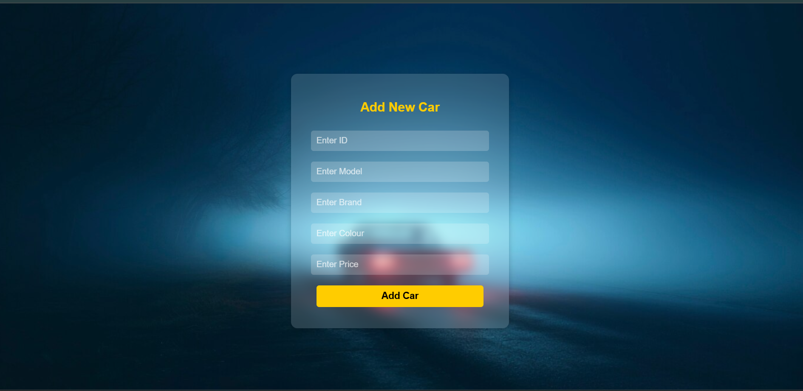
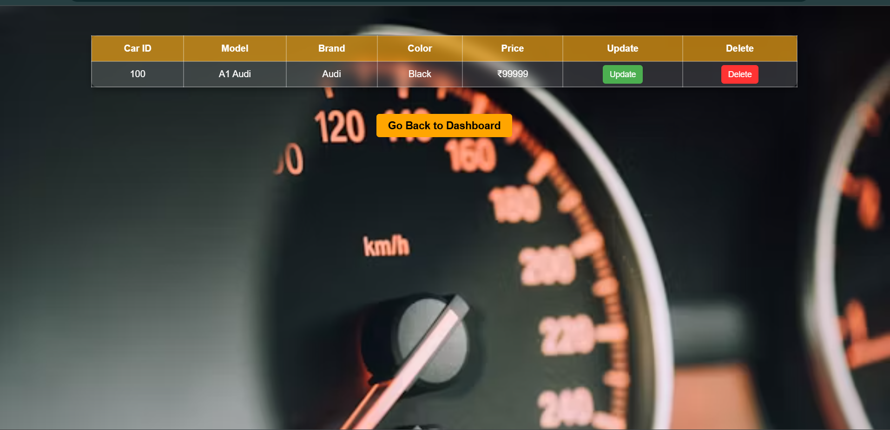
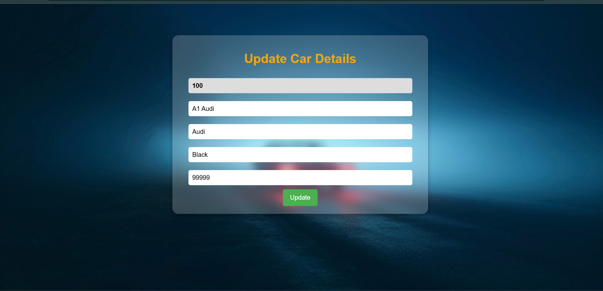

## Car Database Management System

## Overview
The Car Database Management System is a comprehensive solution designed to efficiently store, manage, and retrieve vehicle-related information. It provides an intuitive and visually enhanced User Interface (UI), ensuring seamless navigation and an improved user experience.

## Technologies Used 🛠️
- Frontend: JSP (JavaServer Pages)
- Backend: Servlets (HttpServlet)
- Database:MySQL (JDBC for connectivity)
- Build Tool: Maven
- Dependencies Used: `mysql-connector-java`, `jsp-api`, `javax.servlet-api`

## Key Features of the UI Modification:
Modern & Responsive Design: The interface is now more interactive, utilizing a clean and structured layout.
Enhanced Navigation: A sidebar or dashboard menu enables easy access to different sections like vehicle records, customer details, and reports.
Search & Filter Options: Users can quickly search and filter cars based on attributes such as model, brand, year, and availability.
Dynamic Data Visualization: Graphs and charts display key insights, such as sales trends and stock availability.
Optimized Forms & Tables: Improved input fields and tabular layouts ensure smooth data entry and viewing.

### Expected Output

